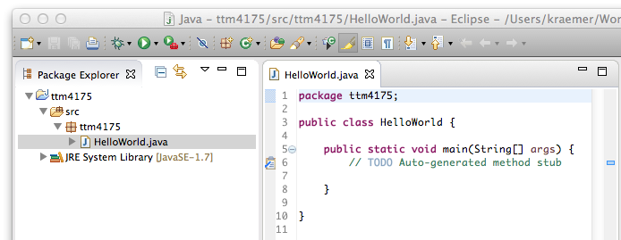

# Hello World in Eclipse

In this first step we are going to write and run our first Java application in Eclipse.
After this lecture, you should now be able to:

* Create new Java projects in Eclipse
* Create new Java programs in Eclipse with a simple main method (but not much else yet)
* Run these Java programs

After we have learned how we write and start these very simple applications, we will spend more time on the language and how we write more complex programs.

## Eclipse 

Eclipse is a development environment. It started originally as a pure Java development tool, but evolved into a technology platform into which many other tools and applications can be integrated. The development of Eclipse is managed by the [Eclipse Community], which also hosts other open-source projects, all more or less related to Eclipse. 

[Eclipse Community]: http://www.eclipse.org/

Understanding all features of Eclipse will take more time than we have. In the following, we only focus on the most important ones to get started with Java programming. There are many sources to learn more about Eclipse. 
Here are some that can give you a further introduction:

* http://eclipsetutorial.sourceforge.net/index.html
* http://eclipsetutorial.sourceforge.net/Total_Beginner_Companion_Document.pdf
* http://www.csee.umbc.edu/courses/undergraduate/341/fall08/Lectures/Eclipse/intro-to-eclipse.pdf

Eclipse is itself a Java program. It is also possible to develop Java without a development environment, just using a simple text editor and the compiler from the command line. But since it is much easier to get started in a development environment, we start with Eclipse right away. There are also other development environments for Java, for instance [Netbeans] and [IntelliJ IDEA].

[Netbeans]: https://netbeans.org/
[IntelliJ IDEA]: http://www.jetbrains.com/idea/

## The Eclipse Workbench

After you installed Eclipse and start it for the first time, you will see the welcome page. You can close this page in the upper right corner, with the button labelled "Workbench".

The Eclipse **workbench** is the set of windows where you are going to work. The main window is usually the **editor**, where you edit files. There are different types of editors that are specialized for different types of files. The other windows are called **views**. These views show additional information, for instance an overview of your files or a console.

The views and editors are arranged in a particular way that supports a certain task. This arrangement is preconfigured, and these configurations are called **perspectives**. For programming in Java, open the **Java perspective**. You can see in the upper right corner which perspective is currently selected. 

If the Java perspective is not already opened, you can open it:

Window / Open Perspective / Other... / Java 

You can re-arrange the views and editors as you wish. If you want to go back to the orignal layout of a perspective, simply select *Window / Reset perspective...* You can also open more views via *Window / Show View / Others...*

The Java perspective contains by default a number of views that are useful for Java editing. For now, we are not going to use the Task list, Outline, Declaration and Javadoc views. To get more space on your screen, you can close them.
The only views we are going to use are the following:

* The **Package Explorer.** It shows the Java source files and important information about our Java project.
* The **Java Editor.** This is where we are going to write our Java source code.
* The **Problems view** displays explanations of programming errors.
* The **Console view** shows the output of Java programs when they run. This view will open automatically when you run a Java program from within Eclipse.

## The Eclipse Workspace

Eclipse organizes all your files in the **workspace**. This workspace corresponds to a folder on your hard disk, and Eclipse asks you at startup which workspace it should open. This means that you can have several workspaces. I have, for instance, a speparate workspace for this course (ttm4175), but a different workspace for the course ttm4115.

The workspace contains several Eclipse **projects**. These projects correspond to sub-folders within the workspace folder. (Projects can also be configured to reside in totally different places, but we ignore that for now.)

Eclipse projects are units of work that belong together, but they can still refer to each other. When you develop a large application, for instance, you can structure it into different projects that refer to each other. Later in the course, for instance, we will have different Eclipse projects for each larger exercise, just to separate things from each other.
You can see the projects in the Package Explorer. It will probably be empty; so let's create a project first.

When you create a new Eclipse project, you can select the type of project. When we select to create a Java project, for example, Eclipse will already create some folders and files that are useful for Java development. It will also create some default settings. In addition, the type of project determines what happens in the background whenever you save a file, but more on that later.

* Create new projects via File / New Project...
* From there, select **Java Project**.
* Give the project a name, for instance *ttm4175*
* The project will be created in the default location (the folder within the workspace folder on your hard disk) and with the default settings for Java projects. These defaults are good for us, so leave them as they are and select **Finish**.

(In the screenshot, you see that for the JRE, Java 8 is selected. Since we ask you to install Java 7, this will be different in your case. Simply leave the JRE value at its default, for the Hello World it will work anyways.)

## The Java Project and the Package Explorer

After creating the Java project, it will show up in the Package explorer view.

The source folder, called *src* will contain all our Java source files. Since we have not created any source code yet, it is empty. So let's create a new class:

* Right-click the *src*-folder
* Select New / Class

The class needs a name. We call it *HelloWorld*, and enter it in the field labelled *Name:*. The package in which we are going to create the class is already called the same as the project, that is *ttm4175*. 

Since we want to execute that class, we also need a main method. Therefore, we click the check box *public static void main(String[] args)* (Later more on what that is.) The other settings are good as they are.

Click finish, and the following class will be created:

## Hello World

To write our program, we remove the comments (the lines that are started by the comment markers "//"), and replace it with a code line that prints out a message:

	public static void main(String[] args) {
		System.out.println("Hello World!");
	}

(We will later have a close look at all the elements in that code line.)

## Running Hello World

In Eclipse, we can directly run Java programs:

* Select the file *HelloWorld.java* in the Package Explorer
* Select Run As / Java Application

The console view will open, and you will see the following output:

We have just created and started our fist Java application!