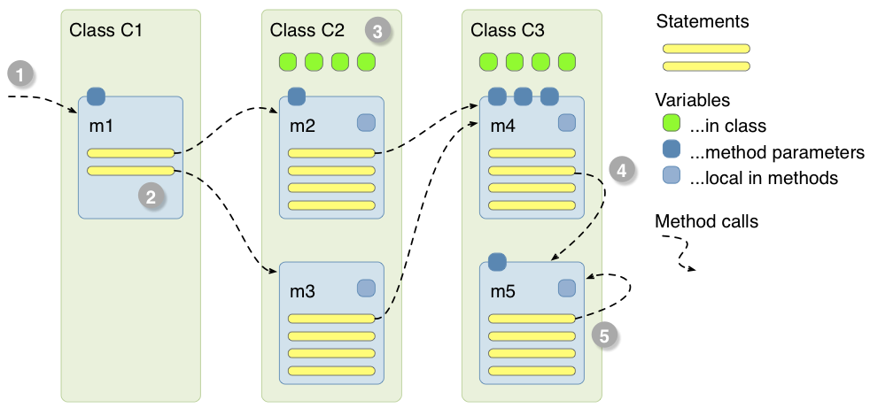

# The Java Language - Part 2

In the previous part, we have learned how to write some simple programs withing a single method. In this second part, we will have a look at how programs are structured using methods and classes. We will also see what objects are.

## Methods

Methods are a way to structure programs into smaller tasks that can be easily reused. We have already used the method `System.out.println()` to write output to the console, and we got familiar with the method `Math.random()` that returned a random number.

Methods can return a value. For instance, the method below takes the two integer values that we pass to it, and returns their sum:

    public static int addTogether(int a, int b) {
        return a + b;
    }

The return value of the method is `int`.

A method without any return value simply declares that it returns `void`. The method below, for instance, prints out the value of `a || b`, but does not return any value:

    public static void printLogicOr(boolean a, boolean b) {
        System.out.println(" " + a + "  " + b + "  " + (a || b));
    }

With this method, the truth table that we have written previously can be expressed much nicer:

    printLogicOr(false, false);    
    printLogicOr(false, true);    
    printLogicOr(true,  false);    
    printLogicOr(true,  true); 

## Running Programs Means Executing Methods

When we run a Java application, we start the main method of our main class (1). Within this method, we have statements, like assignments of values to variables or if-statements. Statements can also call other methods. For instance, the main method m1 on the example below calls first method m2 of class C2 and then method m3 (2), (3). These methods can call in turn other methods. In class C3 we see that method m4 calls method m5 (4), and that m5 calls itself (5). Once all methods have finished (we say, they "return"), the main method started in the beginning finishes and the application ends.

    
    
You can read more about methods [here][methods].

[methods]: http://docs.oracle.com/javase/tutorial/java/javaOO/methods.html

## Importing Packages

We have so far worked only in our own package `ttm4175`. As soon as we need access to classes outside of our own package, we need to import packages. An exception is the package `java.lang`. It contains the classes System and Math, which we already used. This package is imported by default.

If we want to use other classes, we need to import them. We do this right after the package declaration. For instance, when we need to import the classes for sets and lists, we do the following:

    import java.util.ArrayList;
    import java.util.HashSet;
    import java.util.List;
    import java.util.Set;

This imports the types `ArrayList`, `HashSet`, `List`, and `Set` from the package `java.util`.

## Classes and Objects

An object is a data structure combined with some methods. It is called an object, because it can be compared with objects in real life: It is a "thing", and we can do somehting with it. The "things" is what we describe by the data. And the stuff we do with it is described by its methods.

Let us create a new object. This object is a list, into which we can put other elements:

    ArrayList list1;
    list1 = new ArrayList();
    
The first line declares a variable with name `list`. The second line creates an object of type `ArrayList`, and assigns it to variable `list1`. The keyword `new` has really created an object. It now resides in the memory of our program.  `ArrayList` is a class that is part of the standard library of Java. When we create a new object, we also say that we "instantiate" a class. I.e., we create an instance.

When we have an object, we can call methods on it. We can, for example, add elements into the array list:

    list1.add("A");
    list1.add("B");
    list1.add("C");
    list1.add("D");
    
We added four elements to the array list, using the method `add()` that is declared for the class `ArrayList`.
We can also call other methods on the list:

    int size = list1.size();
    System.out.println("Size: " + size);
    
This program prints out `4`, since the list contains the elements A, B, C, D.     

The example above shows how we use a given class (`ArrayList`), create an object from it, and work with it. Of course, we can also declare our own classes, from which we can create our own objects: 
As illustration we use a simple [bicycle example] from the Java tutorial. 

[bicycle example]: http://docs.oracle.com/javase/tutorial/java/concepts/class.html

    class Bicycle {

    int cadence = 0;
    int speed = 0;
    int gear = 1;

    void changeCadence(int newValue) {
         cadence = newValue;
    }

    void changeGear(int newValue) {
         gear = newValue;
    }

    void speedUp(int increment) {
         speed = speed + increment;   
    }

    void applyBrakes(int decrement) {
         speed = speed - decrement;
    }

    void printStates() {
         System.out.println("cadence:" +
             cadence + " speed:" + 
             speed + " gear:" + gear);
    }
    }

The declaration above is a class. We have not created any object from the class. This means that there exists no bicycle in memory yet. 

The [code below] shows how we can use the Bicycle class. We declare two variables, bike1 and bike2. Both variables are of type Bicycle. The type corresponds to the class name. With the operator new we create new instances of Bicycle, and assign it to variables bike1 and bike2.

So now, our application has created two objects of type Bicycle. This also means that the memory used by our application increased. When creating the bicycles, variables for their fields cadence, speed and gear have been created. 

[code below]: http://docs.oracle.com/javase/tutorial/java/concepts/class.html

    public static void main(String[] args) {

        // Create two different Bicycle objects
        Bicycle bike1 = new Bicycle();
        Bicycle bike2 = new Bicycle();

        // Invoke methods on those objects
        bike1.changeCadence(50);
        bike1.speedUp(10);
        bike1.changeGear(2);
        bike1.printStates();

        bike2.changeCadence(50);
        bike2.speedUp(10);
        bike2.changeGear(2);
        bike2.changeCadence(40);
        bike2.speedUp(10);
        bike2.changeGear(3);
        bike2.printStates();
    }

After the creation of the objects with new, we use the methods defined in Bicycle to work on their data. To invoke the method, we write the name of the variable, a dot, and then the method name that should be invoked, together with the argument.

    cadence:50 speed:10 gear:2
    cadence:40 speed:20 gear:3

The output of this test prints the ending pedal cadence, speed, and gear for the two bicycles:

## Constructors

You can read more about objects and classes [here][oo].

[oo]: http://en.wikipedia.org/wiki/Object-oriented_programming

## Other Language Features

**Reflection:** A Java program can analyze a type during runtime. For example, you can check if a class has a certain method implemented, and invoking that method.

**Inner Classes:** All data types in Java (apart from the built-in primitives) are defined by classes. With inner classes, you can declare classes also *within* another class, as a helper construct.

**Assertions:** Assertions are statements in the program that make a claim that something is true. 

     assert numerOfLeaves > 0;

Here, for instance, we assert that a certain variable is larger than zero. This is helpful for developers, because after the assert statement we do not have to take the case into account that the numberOfLeaves is zero or smaller. In case the assertion does not evaluate to true, the line throws an AssertionException. 

**Generics:** A list, for instance, can hold any type of object. That is why the method to add a new element to the list has the signature `add(Object o)` This also means that when we retrieve an element from a list, we only know that it is an object. We have to cast it into a specific class if we want to invoke any methods on it that are defined by that class.

With generics, we can declare that the list contains only objects of a certain type. 

**Annotations:**

**Autoboxing:**

**Enumerations:**

Enumerations can define a data type that consist of a set of predefined constants. For instance, we can define a day as follows:

    public enum Day {
        SUNDAY, MONDAY, TUESDAY, WEDNESDAY,
        THURSDAY, FRIDAY, SATURDAY 
    }
    
Another solution would be to encode a day as an integer, and having a convention that sunday=0, monday=1, and so on. By defining enumerations, we have several benefits:

* they can be part of a switch statement, and the compiler can check if we distinguish all cases
* makes programs more expressive, and type save
* easier to debug
* enumerations can also define methods and variables. we can realize anything that would fit into a table, as long as the entires in the table are constant.

http://docs.oracle.com/javase/tutorial/java/javaOO/enum.html    

**Varargs:**

**For Each Loops:**

**Lambda Expressions:**

http://www.oracle.com/webfolder/technetwork/tutorials/obe/java/Lambda-QuickStart/index.html

**Streams:**

http://en.wikipedia.org/wiki/MapReduce

## Java Keywords

Some keywords are used for several different functions. The keyword *static*, for instance, can be used to declare static variables,  inner static classes and static imports. Since this is only an introduction, we will in the following learn only the *main* or *most important* function of that keyword. 

Creating and referring to objects:

    new, super, this

Importing and declaration of packages:

    import, package

To flag final or static variables and methods:

    final, static 

To manage return types of methods:

    return, void

To manage the visibility of types and variables:
    
    private, protected, public

Declaration of classes, interfaces, enumerations:
    
    class, enum, extends, implements, interface

Program control flow:
    
    break, case, continue, default, do, else, for, if, switch, while

Exception handling:

    catch, throw, throws, try 

Primitive types: 
    
    boolean, byte, char, double, float, int, long, short

Literal values:

    false, null, true

We will ignore the following:
    
    abstract, continue, instanceof, finally, native, strictfp, synchronized, transient, volatile, const, goto