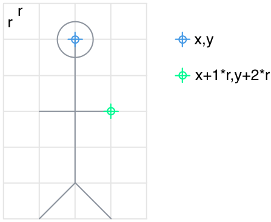
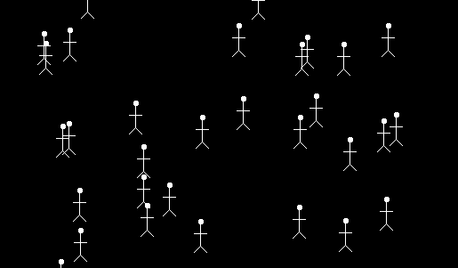
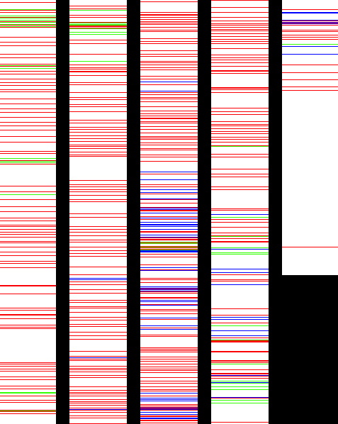
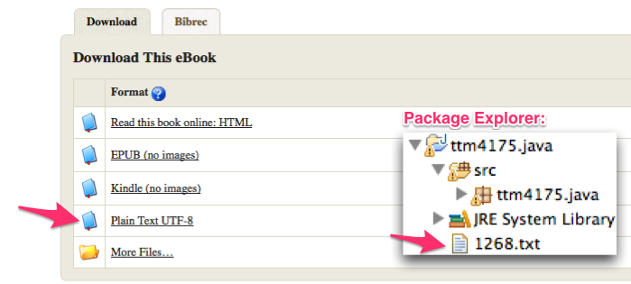

# Lab A1: Java and Eclipse (Week 2)

## Exceptions

**Task 1.12:**
Create an array and write some lines so that your program causes an `ArrayIndexOutOfBoundsException`. If you are unsure how to cause such an exception, read the [documentation of this error].

[documentation of this error]: http://docs.oracle.com/javase/7/docs/api/java/lang/ArrayIndexOutOfBoundsException.html

Copy and paste the code into your report. Then, correct the program so that the error does not happen anymore. Copy and paste also this code into your report. 

**Task 1.13:**
Create a very short program that causes a `NullPointerException`. (Use any type of object or class that you like.)
If you are unsure how to cause such an exception, read the [documentation of this error].

[documentation of this error]: http://docs.oracle.com/javase/7/docs/api/java/lang/NullPointerException.html

Copy and paste the code into your report. Then, correct the program so that the error does not happen anymore. Copy and paste also this code into your report.

**Task 1.14: (Advanced)**
It may seem annoying that the programming language causes an exception in these cases. Why, do you think, is it better that these exceptions happen, instead of the program just continuing as if nothing has happened?

## Java Collections

**Task 1.15:**
Read the documentation for the [list] and the [set] interfaces. Both are collections of objects. State briefly in your own words what the most important difference between lists and sets is.

[list]: http://docs.oracle.com/javase/8/docs/api/index.html?java/util/List.html
[set]: http://docs.oracle.com/javase/8/docs/api/index.html?java/util/Set.html

**Task 1.16:**
Thinks of a couple of examples for cases where you would use lists and where you would use sets.

**Task 1.17: (Advanced)**
Why does the method `java.util.Collections.sort(List)` ([documentation][sort]) only accept lists as arguments, not sets?

[sort]: http://docs.oracle.com/javase/8/docs/api/java/util/Collections.html#sort-java.util.List-

## Fun with the Morse Code Map

Another important data structure is a **map**. In contrast to the list and set, it realizes a lookup table, where a key points to a value. We use it to encode and decode morse code. Morse code translates letters and figures into signs that consist of short or long signals, so that they can be transmitted in various ways. Here's the morse code table:

    a .-      j .---   s ...
    b -...    k -.-    t -
    c -.-.    l .-..   u ..- 
    d -..     m --     v ...-
    e .       n -.     w .--
    f ..-.    o ---    x -..-
    g --.     p .--.   y -.--
    h ....    q --.-   z --..
    i ..      r .-.
    
    1 .----   6 -....
    2 ..---   7 --...
    3 ...--   8 ---..
    4 ....-   9 ----.
    5 .....   0 -----
    
The method `getCharacterToMorseCodeMap()` shown below produces a map object that contains the table from above. The map contains the characters (`a`,`b`,`c`,...) as keys, and their corresponding morse codes (`.-`, `-...`, `-.-.`,...) as values. These morse code values are stored as Strings.  

	public static Map<Character, String> 
	                        getCharacterToMorseCodeMap() {
		Map<Character, String> morse = 
            new HashMap<Character, String>();
		morse.put('a',".-");
		morse.put('b',"-...");
		morse.put('c',"-.-.");
		morse.put('d',"-..");
		morse.put('e',".");
		morse.put('f',"..-.");
		morse.put('g',"--.");
		morse.put('h',"....");
		morse.put('i',"..");
		morse.put('j',".---");
		morse.put('k',"-.-");
		morse.put('l',".-..");
		morse.put('m',"--");
		morse.put('n',"-.");
		morse.put('o',"---");
		morse.put('p',".--.");
		morse.put('q',"--.-");
		morse.put('r',".-.");
		morse.put('s',"...");
		morse.put('t',"-");
		morse.put('u',"..-");
		morse.put('v',"...-");
		morse.put('w',".--");
		morse.put('x',"-..-");
		morse.put('y',"-.--");
		morse.put('z',"--..");
		
		morse.put('0',"-----");
		morse.put('1',".----");
		morse.put('2',"..---");
		morse.put('3',"...--");
		morse.put('4',"....-");
		morse.put('5',".....");
		morse.put('6',"-....");
		morse.put('7',"--...");
		morse.put('8',"---..");
		morse.put('9',"----.");
		return morse;
	} 

**Task 1.18:**
Use the map from above to encode a short message into morse code. Use the `get()` method of the map to retrieve the morse code for the characters. You can get an instance of the map object with the morse code in the following way:

	public static void main(String[] args) {
		Map<Character, String> morse = 
		                      getCharacterToMorseCodeMap();
        ...
	}

The method below realizes another table. It is the inverse of the map from above. It can be used to decode morse code back into the characters.

	public static Map<String, Character> 
	                         getMorseCodeToCharacterMap() {
		Map<String, Character> morse = 
            new HashMap<String, Character>();
		morse.put(".-",'a');
		morse.put("-...",'b');
		morse.put("-.-.",'c');
		morse.put("-..",'d');
		morse.put(".",'e');
		morse.put("..-.",'f');
		morse.put("--.",'g');
		morse.put("....",'h');
		morse.put("..",'i');
		morse.put(".---",'j');
		morse.put("-.-",'k');
		morse.put(".-..",'l');
		morse.put("--",'m');
		morse.put("-.",'n');
		morse.put("---",'o');
		morse.put(".--.",'p');
		morse.put("--.-",'q');
		morse.put(".-.",'r');
		morse.put("...",'s');
		morse.put("-",'t');
		morse.put("..-",'u');
		morse.put("...-",'v');
		morse.put(".--",'w');
		morse.put("-..-",'x');		
		morse.put("-.--",'y');
		morse.put("--..",'z');

		morse.put(".----",'1');
		morse.put("..---",'2');
		morse.put("...--",'3');
		morse.put("....-",'4');
		morse.put(".....",'5');
		morse.put("-....",'6');
		morse.put("--...",'7');
		morse.put("---..",'8');		
		morse.put("----.",'9');
		morse.put("-----",'0');
		return morse;
	}

**Task 1.19:**
The method below returns a String with a morse-encoded word. The morse code for each character in the word are separated by a whitespace character (" "). Try to build a short program that decodes the morse code and gets the word back. 

	public static String getSecretWord() {
		return "-. - -. ..-";
	}
    
The following code can take a String (like the one that `getSecretWord` returns), and split it into pieces. By default, it splits a String wherever a whitespace character is.    
    
    StringTokenizer s = new StringTokenizer("A B C");
	while(s.hasMoreTokens()) {
		String token = s.nextToken();
		System.out.println(token);
	}
    
Run the code above just to get familiar with the string tokenizer. It should return the following output:

    A
    B
    C

Now, combine the string tokenizer with the inverse morse code map to decode the secret word. Include the solution in your report. What was the secret word? 

    
**Task 1.20: (Advanced)**
The method below contains a complete message. It is handled as an array of strings. Each element of the array is a word in the message. Write a short program that decodes the entire message.

	public static String[] getSecretMessage() {
		return new String[] {
				"--- --.",
				"-.. ..-",
				"... -.- .--- . -- -- . ...",
				". ..",
				"..-. --- .-.",
				"-.. .. -.",
				"-- --- .-.",
				"..-. --- . .-. ... -",
				"... .- .-",
				".-. . -. -. . .-.",
				"-.. ..-",
				"- .. .-..",
				"..-. .--- . .-.. .-.. ...",
				"-- .- .- -. . -.. ... ...- .. ...",
				"..",
				"- .-. .- ...- .-.. .",
				"--- -. -. . -.",
				"..-. --- .-.",
				".- -",
				"...- . .--- -.. .",
				".-. . -.",
				".--. .- .-",
				"..-. --- -. -. . -.",
				"-.- --- -- -- . .-.",
				".... .--- . --",
				"-- . -..",
				".-. . ...- . -.",
				".--. . .-.. ...",
				"..- - . -.",
				"-... --- . .-. ... .",
				"..- - . -.",
				"...- .. .-.. .-.. -",
				"--- --.",
				"- .. .-..",
				"... .-.. ..- - -",
				"-- . -..",
				".- .- .--. -. .",
				"--- . -.-- -. .",
				"-- . -. . .-.",
				"-.. ..-",
				".- -",
				"..-. .- .-",
				"-- . --.",
				"-... .. .-.. -.. -",
				".. -. -.",
				"-.. .",
				"...- .- . .-. ... - .",
				"... -.- .-. -.-- - . .-.. --- . --. -. .",
				"-. .- .-",
				".... ...- --- .-.",
				"- .-. .- ..-. ..-.",
				"-.. .",
				"... .- .-",
				"-.. . -.",
				"-... ..- -.- -.- . -."};		
	}

<!--
http://runeberg.org/peergynt/1a.html
-->

**Task 1.21 (Super-Advanced):**
(Try to solve this task only if you have more time and energy left at the end of the lab.) Another way to decode Morse signals into letters is via Dichotomic search, as shown at the end of http://en.wikipedia.org/wiki/Morse_code. Implement a method that uses this method of decoding morse signals, and use it for the transmission above.  

## Drawing Images by Code

The class `java.awt.Graphics2D` can draw simple figures on an image. 

	public static void main(String[] args) {
		
		// create an image and the 
		// graphics object to draw on it
		int width = 1000;
		int height = 1000;
		BufferedImage image = new BufferedImage(width, 
		            height, BufferedImage.TYPE_INT_RGB);
		Graphics2D g = image.createGraphics();

		// draw!
		drawStickFigure((int) (Math.random()*width), 
		                  (int) (Math.random()*height), g);

        // show the image
		openImage(image);
	}
    
The method below can draw a simple stick figure:

	public static void drawStickFigure(int x, int y, Graphics2D g) {
		int r = 7;
		// the head
		g.fillOval(x-r/2, y-r/2, r, r);
		// the body
		g.drawLine(x, y, x, y+4*r);
		// the arms 
		g.drawLine(x-r, y+2*r, x+r, y+2*r);
		// both legs
		g.drawLine(x, y+4*r, x+r, y+5*r);
		g.drawLine(x, y+4*r, x-r, y+5*r);
	}
    
   

This is how the stick figure works: The blue markers shows the start point x,y. The other points needed to draw the stick figure are derived from the start point and the variable r. The green point, for instance, is x+r, y+2r. By default, r is chosen to be 7 points. By changing the value of r, the size of the stick figure can be changed.

The method `openImage(image)` opens a window and shows the image created.

	/*
	 * Opens a window that displays the image.
	 */
	public static void openImage(BufferedImage image) {
		ImageIcon icon=new ImageIcon(image);
	    JFrame frame=new JFrame();
	    frame.setLayout(new FlowLayout());
	    frame.setSize(image.getWidth(), image.getHeight());
	    JLabel lbl=new JLabel();
	    lbl.setIcon(icon);
	    frame.add(lbl);
	    frame.setVisible(true);
	    frame.setDefaultCloseOperation(JFrame.EXIT_ON_CLOSE);
	}
    
The methods for drawing need the following import statements:

    import java.awt.Color;
    import java.awt.FlowLayout;
    import java.awt.Graphics2D;
    import java.awt.image.BufferedImage;
    
    import javax.swing.ImageIcon;
    import javax.swing.JFrame;
    import javax.swing.JLabel;

**Task 1.22:**
Use the method to print stick figures all over the image. To get random numbers, you can again use the `Math.random()` method. Note that the result of the random method must be transformed into an integer. You can do this in the following way: 

    int x = (int) (Math.random()* width);

Math.random() returns a double, that means a floating point value. We multiply it first with the width of the image. This results again in a floating point value. The `(int)` is rounding the floating point number into an integer. The result should look like this:

**Task 1.23 (Advanced):**
Create a method that returns a random color, and use it to draw stick figures of different colors.  

Have a look at the [documentation of Graphics] and [documentation of Graphics2D]. You'll find methods to draw different shapes. Methods that begin with *fill* draw a solid figure, methods that begin with *draw* create only their outline. To set the color, use the following method:

    g.setColor(Color.GREEN);

It switches the drawing color to green. Whatever is drawn after that, is drawn in green.
You can also mix your own colors, by creating a new color object. Its constructor takes the RGB (red/green/blue) values as an integer, from 0 to 255. You can find the RGB values of colors for [here]. The blue from NTNU, for instance, is defined by RGB 14, 41, 136.

    Color ntnuBlue = new Color(14, 41, 136);
    g.setColor(ntnuBlue);

[documentation of Graphics]: http://docs.oracle.com/javase/7/docs/api/java/awt/Graphics.html
[documentation of Graphics2D]: http://docs.oracle.com/javase/7/docs/api/java/awt/Graphics2D.html
[here]: http://www.rapidtables.com/web/color/RGB_Color.htm

---

**Task 1.24:**
Use some methods in Graphics2D to draw a picture. Make use of loops and other control structures to draw something interesting. Include the code and the resulting image in your report. 

## Book Scanning

Now we want to combine our ability to draw pictures and to analyze some data. Let us analyze the content of some books!

1. Download a book from Gutenberg
2. Find out in which lines of the book the main characters of the book appear
3. Draw a picture with this information

The result for Alice in Wonderland looks like that:

The red stripes are the lines in which "Alice" is mentioned, the green ones mention the "rabbit", and the blue ones the "queen". If you are remotely familiar with the book, you can confirm that this distribution og the characters makes sense. 

* Go to [Project Gutenberg][Project Gutenberg] and find one or more books that you are more or less familiar with. Download the Plain Text UTF-8 version of the book. *(Previously, we had a version that downloaded books directly from Gutenberg, which is technically easy. However, if we run too many requests towards gutenberg.org, the server asks at some point to solve a captcha. By storing the file locally, you can try as often as you want, and we reduce network traffic.)*
* Place the file directly in the Eclipse project in which you program. It should be on the same level as the `src`folder.

[Project Gutenberg]: http://www.gutenberg.org/

Have a look at the methods listed below:

* `loadFromFile(String fileName)` can load the content of a file as a String.
* `getLines(String text)` parses a string and separates it into its lines, so that we can work on them.

[Project Gutenberg]: http://www.gutenberg.org/

	/*
	 * Parses the given text and returns a list of strings,
	 * where each string is one line of the original text.
	 */
	public static List<String> getLines(String text) {
		BufferedReader reader = 
		         new BufferedReader(new StringReader(text));
		List<String> allLines = new ArrayList<String>();
		try {
			String line = reader.readLine();
			while(line!=null) {
				if(!line.trim().isEmpty()) {
					allLines.add(line);
				}
				line = reader.readLine();
			}
		} catch (IOException e) {
			e.printStackTrace();
		}
		return allLines;
	}

	/*
	 * Reads a file with the given name and extracts its 
	 * content as a String. The file should be placed right 
	 * under the Eclipse project of this application.
	 */
	public static String loadFromFile(String fileName) {
		try {
			File file = new File(fileName);
			if(!file.exists()) {
				System.err.println("Could not find the file."
				  + "Is it placed correctly and is the name right?");
				System.err.println("Was searching for: " 
				  + file.getAbsolutePath());
			}
			InputStream stream = new FileInputStream(file);
			Scanner scanner = new Scanner(stream, "UTF-8");
			String response = scanner.useDelimiter("\\A").next();
			scanner.close();
			return response;
		} catch (IOException e) {
			e.printStackTrace();
			return null;
		}
	}
    
    
See below the code to produce such an image:

    
	public static void main(String[] args) {
		
		String response = loadFromFile("1268.txt");
		// parse the text into lines
		List<String> allLines = getLines(response);

		int width = 1000;
		int height = 800;
		int maxColumns = (allLines.size() / height) + 1;
		int colWidth = width/maxColumns;
		
		BufferedImage image = new BufferedImage(width, 
		                height, BufferedImage.TYPE_INT_RGB);
		Graphics2D graphics = image.createGraphics();

		int line = 0;
	    for(int column=0; column<maxColumns 
	                && line<allLines.size(); column++) {
	    	for(int l=0; l<height && line<allLines.size(); l++) {
	    		String currentLine = allLines.get(line);
	    		++line;
	    		graphics.setColor(getLineColor(currentLine));
	    		graphics.drawLine(column*colWidth, l, 
	    		      (column*colWidth) + colWidth -10, l);
	    	}
	    }
		openImage(image);
	}
    
The following method selects a color, depending on which person appears in the line. (For Names that can appear both uppercase or lowercase, we just take the last part of the name, not the first letter.)    
	
	public static Color getLineColor(String line) {
		if(line.contains("Nemo")) {
			return Color.red;
		} else if (line.contains("Nautilus")) {
			return Color.green;
		} else if (line.contains("onseil")) {
			return Color.BLUE;
		} else {
			return Color.white;
		}
	}
    

You will need the following import statements:
    
    import java.awt.Color;
    import java.awt.FlowLayout;
    import java.awt.Graphics2D;
    import java.awt.image.BufferedImage;
    import java.io.BufferedReader;
    import java.io.IOException;
    import java.io.InputStream;
    import java.io.StringReader;
    import java.net.URL;
    import java.util.ArrayList;
    import java.util.List;
    import java.util.Scanner;

    import javax.swing.ImageIcon;
    import javax.swing.JFrame;
    import javax.swing.JLabel;

**Task 1.25:**
Search on Project Gutenberg for a book that you know (at least partially), and analyze in which lines the main characters of the book appear, as described above. Make a screenshot of the generated picture, and explain in the report which book and roles you analyzed.

**Task 1.26 (Advanced):** 
Describe in your own words how the program works. (You do not have to explain or understand every detail.) 

<!--

## Alice in Wonderland

Download the file
Parse it, so that you can process each line.

    http://www.gutenberg.org/cache/epub/11/pg11.txt
    
    
Print the first 30 lines. (Check that it actually is Alice in Wonderland)

Use the String tokenizer to separate all the words within one line.

We have added a method to find out if the word is a very common one, like "the" or "to". Describe in your own words how this method works. 

You can measure the execution time
 

Which chapter mentions the teapot?

>> CHAPTER VII. A Mad Tea-Party
>> 
>> ...
>> This piece of rudeness was more than Alice could bear: she got up in great disgust, and walked off; the Dormouse fell asleep instantly, and neither of the others took the least notice of her going, though she looked back once or twice, half hoping that they would call after her: the last time she saw them, they were trying to put the Dormouse into the teapot.

Which is the word that is most often used?

* ignore the case of the words 

Take out often used words, like "the, a, ..." The result is little surprising. 

Check it by making a wordle. http://www.wordle.net

-->