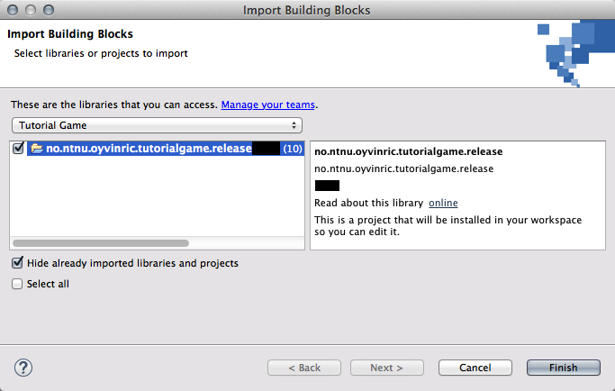

# Tutorial Game

To learn the logic of UML activities, Øyvin Richardsen created in his master thesis from 2014 a game. In this game, you control the figure Malcom through a world and solve simple tasks.

<!--
https://github.com/Desarc/tutorial-game
-->

The tutorial game uses the version of library for game development that is only compatible with Java 7. So make sure you have Java 7 installed.

## Join the Game Tutorial Team

Join the team for team [Tutorial Game]. 

[Tutorial Game]: http://blocks.bitreactive.com/#/group/Gl86vtep1j4v28f2g

## Import the Tutorial Game 

Make sure you have joined the team for the game, as described [here].
The import wizard is [described here]. You can select the team Tutorial Game in the combo box, and then select the project 
**no.ntnu.oyvinric.tutorialgame.release 1.0.0** for import.

[here]: preparation.html
[described here]: http://reference.bitreactive.com/reference/importing-blocks.html

As a result, the Blocks view should look like this:

## Finishing a Level

On each level, you learn about different elements of UML activities. 
Each level consists of two systems: A system called LevelX_Introduction and a system called LevelX.

The Introduction system explains the elements that you are going to learn about in this level. To start the introduction, do the following:

* Richt-click the LevelX_Introduction system
* Select Build / Re-Build for Java Standard Edition
* This creates a project called no.ntnu.oyvinric.tutorialgame.release.levelX_introduction_exe

Within that project, right-click the launch configuration (the file called LavelX_Introduction.launch).

* Select Run As / LevelX_Introduction

Now a window should open that explains the level. Read through the descriptions, and learn more about the elements. The level also shows the map of the playing field and explains the goal of the level. (That means, what Malcom should do.)

After you went through the introduction of a level,
Work on the solution of the level:

Open system LevelX, and use the operations and other elements to build a solution.

Build the systems the same way as you built the introduction to try out your solution. Adjust your design and repeat until you have solved the level.

**Task:**
Try to solve each level. For each level, describe in the report how you solved it, and include a screenshot of your solution.

## Additional Tasks: Speech Synthesis

In case you have time left, you can do the [speech synthesis tutorial]. In this tutorial, you learn how to use a building block for speech synthesis and let the computer talk one sentence after the other.

[speech synthesis tutorial]: http://reference.bitreactive.com/tutorials/speech-buffer-tutorial.html

