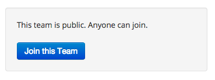

# Preparation

## Install Reactive Blocks

This requires that you have installed Java 7 and Eclipse 4.4 from the previous lab.

* In Eclipse, select Help / Eclipse Marketplace...
* The Marketplace Wizard should open. Search for "Reactive Blocks"
* Click on Install
* After the installation, restart Eclipse

If the installation via the marketplace fails, you can try to install [via the update site].

[via the update site]: http://reference.bitreactive.com/reference/install-from-update-site.html

## Get an Reactive Blocks Account

To get an account, you just [sign in here] with your Google or Facebook account.

[sign in here]: http://blocks.bitreactive.com/login/signup.html

## Join the TTM4175 (2014) Team

To manage which blocks you can see and download, you have to join teams. We have created a team for this course that contains all building blocks that we are going to use. 

After you have signed in, visit the website for team [TTM4175 (2014)], and join the team by clicking *Join this Team*. 

[TTM4175 (2014)]: http://blocks.bitreactive.com/#/group/G5olk12n7ik4aa62a

