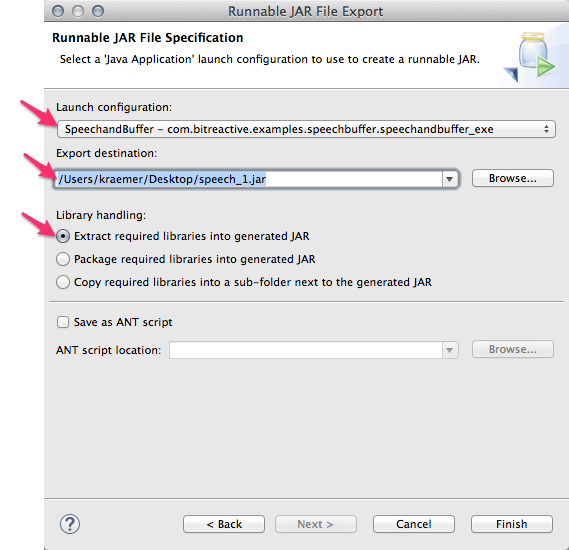

# Java Recipes for the Raspberry Pi

## Exporting a Runnable Jar from Eclipse

You can create a runnable jar file from an Eclipse project that contains all files necessary to run an application. 

* Select File / Export...
* Select Java / Runnable JAR file

The export wizard opens:

* Select the launch configuration that you want to export. Such a launch configuration is created automatically if you have built the project with Reactive Blocks.
* Select the name of the jar file that should be created. Make sure it ends with *.jar.
* Select the first option for library handling.
* Click Finish.
* Ignore possible warnings during the export.

**Tips:**

* It's easy to select the wrong launch configuration, since you may have several runnable applications in your workspace. 
* Whenever you export a new version of an application, change the file name of the jar file. You can, for instance, append a number that you increase with each version. When different versions of a jar file have the same name it is very easy to mess up things and to accidentally run an outdated version. So, never produce a jar file with the exact same name!

## Running Java

It is easiest to pack a Java program as an runnable jar file, copy that jar file to the Pi, and then run it. To start the Java program, use the java command:

   sudo java -jar <myjarfile>.jar

We added `sudo` to run it as super user. This is necessary for some programs, especially those that access the GPIO pins.

## Terminating a Java Program

    ps -ef | grep java

You will see a list of processes that have java in their name. Find the proper process, and copy its process number. 
    
    sudo kill <process-number>
    
You can also use

    sudo killall java