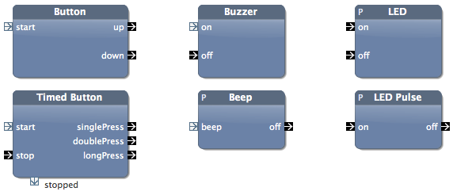
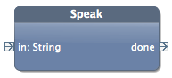
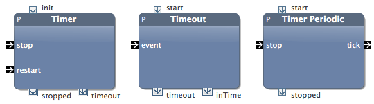

# Programming the Raspberry Pi

## Testing the Berryclip

Download the test program for the Berryclip with the following command:

    wget http://item.ntnu.no/~kraemer/ttm4175/berrycliptest.jar

The command `wget` simply downloads a given file, here a jar file. This jar file contains a Java application that uses the Berryclip. To run the program, start Java:

    sudo java -jar berrycliptest.jar
    
The LEDs should light up one after another. After that, press the button, and you should hear a beep. (If the application does not run, something is wrong. You are officially allowed to panic.)

## Local Morse Code

Use the Import function from the Blocks View, and import the library **Berryclip for Raspbery Pi**.
Also import the project **no.ntnu.ttm4175.morse**.

**Task 1:**
Use the Button and the Buzzer, and build a system with that you can create Morse code, just locally on your own device. Whenever you press down the button, the buzzer should beep. Take a screenshot of the application, and explain how it works.

Hint: Try to build the application on your own. If you have no idea how it should look like, have a glance [here][here2].

[here2]: images/local-morse-code.png

**Task 2:**
Extend the system with the Button and the Buzzer, and add an LED. The LED should light up whenever the button is pressed, together with the buzzer.
Take a screenshot of the application, and explain how it works.

Hint:

* You can easily duplicate building blocks by selecting them in the Blocks view, right-click and select *Duplicate...*

**Task 3:**
Use the Morse Timer block. It meassures the length of the signals. Build an application that prints out a `.` and `-` for each sign. 
Take a screenshot of the application, and explain how it works. 

Hint: Try to build the application on your own. If you have no idea how it should look like, have a glance [here][here3].

[here3]: images/local-morse-code-2.png

The methods should look like this:

	public void printShort() {
		System.out.print(".");
	}

	public void printLong() {
		System.out.print("-");
	}
	
	public void printBreak() {
		System.out.print(" ");
	}

<!--**Task 3:**
Explain the morse timer block.-->

## Sending Morse Code to Yourself, via the Network

To test the network connection, we build a system that connects the button to the buzzer not directly, but via the network.

**Read the hints on using MQTT in the sidebar.**

**Task 4:**
Use the block *Robust MQTT* from the MQTT library. Build an application that works in the following way:

* At startup, Robust MQTT connects to the broker `dev.bitreactive.com`
* Subscribe to a topic that you choose yourself. (Use a unique topic, otherwise you'll receive messages from the other teams.)
* Add a method to the output of Robust MQTT that prints the received message
* Whenever you press the button, ring the buzzer and send a message with some content
* See how the message is received and printed out

Hints:

* Use the MQTT.fx application and see if you are actually sending a message
* You may want to add an LED that lights green whenever Robust MQTT says it is `ready`

Take a screenshot of the application, and explain how it works. 

**Task 5:**
Extend the application from Task 4. Use the Morse Timer so that you can distinguish the between `-` and `.`, and send messages via MQTT that contain `-` and `.` in their payload.

Hints:

* A merge node can be handy here!
* Try to build the application on your own. If you have no idea how it should look like, [have a glance here].

[have a glance here]: images/morse-code-3.png

## Sending Morse Code from one Pi to Another

**Task 6:**
Find another team that you can work together with. Modify the application from the previous task, so that the other team can receive your morse messages, and vice-versa. Challenge each other by sending some messages that the others have to decode.

Hints:

* Agree on a topic to use. (Do you need just one, or two? What happens if you both send to the same topic?)

**Task 7: (Optional)**

Work together with more teams, so that one team is sending morse messages and more than one other team receives them. Which team is faster to decode a message?

## Your Own Idea on the Raspberry Pi and Berryclip

**Task 8:**
Try to come up with your own idea, and build it.

Here are all the block to use the Berryclip:

* **Button** lets you detect when the button is pressed down, and when it moves up again. Note that you can only use *one* button per application.
* **Timed Button** detects if you press once, twice (in short sequence) or if you press for longer. This is useful so you have different  inputs into your application. Cano only be used once per application, and not combined with the Button from above.
* **Buzzer** lets you control the buzzer, and switch it on or off.
* **Beep** uses the buffer and beeps for a certain time. You can configure the time as instance parameter. Right-click, and select *Parameters and Generics..*
* **LED** control a single LED. You can determine which LED it controlls with an instance parameter. (This block you can use as often as you want, for each LED.)
* **LED Pulse** works similar to the Beep, and blinks an LED for a short time.

The library "Speech Synthesis" includes a block to speak. (When using it on the Raspberry Pi, you'll need to plug in your headphones.)

Here are blocks that are related to timers:

Apart from these blocks, you can of course use everything that we already have used above, including MQTT.

In the best case, think of your own idea what to build. Here are some suggestions, some more or less simple. 

* Simple: Blink some lights, periodically.
* Dice Machine
* Reaction Game
* Simulate a traffic light (together with others?) 

