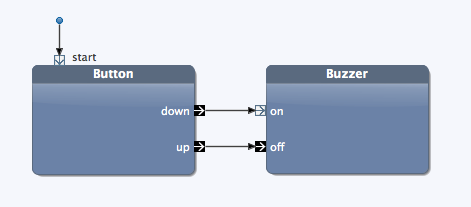
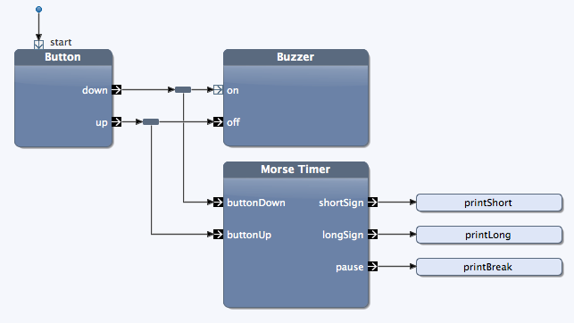
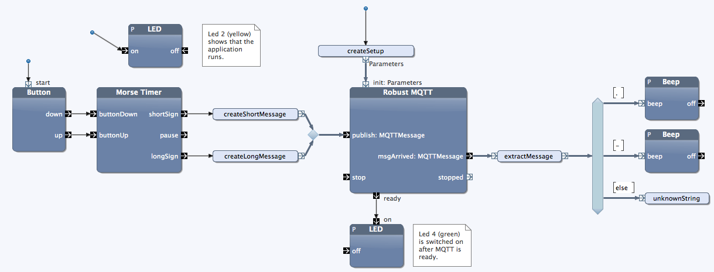

# Programming the Raspberry Pi

## Testing the Berryclip

Download the test program for the Berryclip with the following command:

    wget http://item.ntnu.no/~kraemer/ttm4175/berrycliptest.jar

The command `wget` simply downloads a given file, here a jar file. This jar file contains a Java application that uses the Berryclip. To run the program, start Java:

    sudo java -jar berrycliptest.jar
    
The LEDs should light up one after another. After that, press the button, and you should hear a beep. (If the application does not run, something is wrong. You are officially allowed to panic.)

## Local Morse Code

Use the Import function from the Blocks View, and import the library **Berryclip for Raspbery Pi**.
Also import the project **no.ntnu.ttm4175.morse**.

**Task 1:**
Use the Button and the Buzzer, and build a system with that you can create Morse code, just locally on your own device.

**Task 2:**
Use the Morse Timer block. It meassures the length of the signals. With it, we can print out the `.` and `-` for each sign. 

The methods should look like this:

	public void printShort() {
		System.out.print(".");
	}

	public void printLong() {
		System.out.print("-");
	}
	
	public void printBreak() {
		System.out.print(" ");
	}

(We will later use the Morse Timer block so we can send the morse signs over the network.)

**Task 3:**
Explain the morse timer block.

## Sending Morse Code to Yourself, via the Network

To test the network connection, we build a system that connects the button to the buzzer not directly, but via the network.

    import com.bitreactive.library.mqtt.MQTTConfigParam;
    import com.bitreactive.library.mqtt.MQTTMessage;
    import com.bitreactive.library.mqtt.robustmqtt.RobustMQTT.Parameters;

	public String topic;
	public static String SHORT_MESSAGE = ".";
	public static String LONG_MESSAGE = "-";
	
	public MQTTMessage createShortMessage() {
		byte[] bytes = new String(SHORT_MESSAGE).getBytes();
		MQTTMessage message = new MQTTMessage(bytes, topic);
		return message;
	}

	public MQTTMessage createLongMessage() {
		byte[] bytes = new String(LONG_MESSAGE).getBytes();
		MQTTMessage message = new MQTTMessage(bytes, topic);
		return message;
	}

	public String extractMessage(MQTTMessage m) {
		return new String(m.getPayload());
	}

	public void unknownString(String s) {
		logError("Unexpected string received: " + s);
	}

	public Parameters createSetup() {
		MQTTConfigParam m = new MQTTConfigParam("dev.bitreactive.com");
		topic = "t" + Math.random();
		m.addSubscribeTopic(topic);
		Parameters p = new Parameters(m, 5);
		return p;
	}

Listen to the same topic as you send the messages to. 
Make sure the topic is unique, so you do not hear the morse signals of other teams that use the same broker.

## Sending Morse Code from one Pi to Another

Find another group.

Build the receiver.
Build the sender.

Agree on a topic to use. 

Challenge each other by sending morse code, let the others decode.

Extra: Make three teams, one team is sending to the two others. Which team is faster to decide the message?