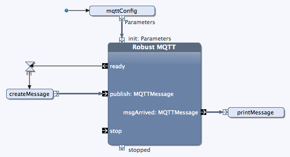

# Using MQTT

## Debugging MQTT

During the lab you will send and receive messages via MQTT. To find out, if messages are sent, you can install an application that lets you subscribe to MQTT topics. In this way you will know if your application sends messages as it should. One such application is [MQTTfx], which you can download from [here]. (Works for Mac or Windows.)

[MQTTfx]: http://www.jensd.de/wordpress/?p=1423
[here]: http://www.jensd.de/apps/mqttfx/

To use the application, simply add the MQTT broker you are using, and subscribe to the topics you are working with.

## Using the MQTT Block

### Starting Robust MQTT

To start the Robust MQTT block, it expects an object of type `Parameter`, that includes some information needed at startup.
You can create this object with a method. The content of the method can look like shown below. In that example, we connect to the MQTT broker running at `dev.bitreactive.com`, and subscribe to the topic `a/b/c`.

	public Parameters createSetup() {
		MQTTConfigParam m = new MQTTConfigParam("dev.bitreactive.com");
		m.addSubscribeTopic("a/b/c");
		Parameters p = new Parameters(m);
		return p;
	}
    
Use the following import statements at the top of the class:

    import com.bitreactive.library.mqtt.MQTTConfigParam;
    import com.bitreactive.library.mqtt.MQTTMessage;
    import com.bitreactive.library.mqtt.robustmqtt.RobustMQTT.Parameters;

### Sending a Message

To send a message, we create an object of type `MQTTMessage` and send it via pin `publish`. The method below creates such a message. In the example, we set the quality of service to '2', publish the message to topic `a/b/c`, and send over an `Hello!`. 

	public MQTTMessage createMessage() {
    	String payload = "Hello!";
		byte[] bytes = payload.getBytes();
        String topic = "a/b/c";
		MQTTMessage message = new MQTTMessage(bytes, topic);
		message.setQoS(2);
		return message;
	}

### Printing a Received Message

The following method can print an MQTT message. It converts the incoming payload, which is of type `byte[]`, into a string by using `new String(m.getPayload())`.

	public void printMessage(MQTTMessage m) {
        System.out.println("---------- Received Message ----------");
        System.out.println("Sent to topic: " + m.getTopic());
        System.out.println("Payload: " + new String(m.getPayload()));
        System.out.println("--------------------------------------");
	}