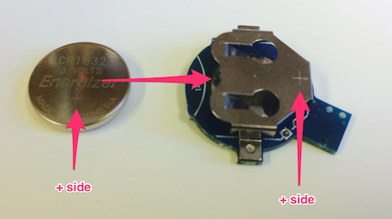
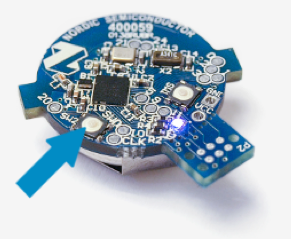

# Lab A4: Bluetooth on the Raspberry Pi

## Add the Bluetooth Dongle

Plug the bluetooth dongle into one of the USB ports of the Pi. 

## Install BlueZ

We also need to install some extra programs to make Bluetooth work on the Raspberry Pi. Just type the following:

    sudo apt-get install bluetooth bluez-utils
    
This may take ca. 5 to 10 minutes. While everything installs, have a look at the [video about the beacon][vid].

[vid]:http://youtu.be/Q5SpUnJTuk8

## Activate the Beacon    
    
Place the battery into the beacon. Make sure that the side of the battery that is marked with `+` points the right way. It should touch the big metal latch on the beacon that is also marked with a `+`.   

## Configure the Beacon  

**Til stuassene: Beskrivelsen for app'en mangler enda. Se om dere klarer det med iPhone eller Android. Ellers kan dere bruke beacons som de er. Det er kun viktig at vi har entydige konfigurasjoner når det er mange som jobber i samme rom.** 

Install the application called **nRF Beacons** either from the App Store on the iPhone or from the Google Play Store for Android. (If you do not have any of the compatible phones, do this tak together with anothe team that has one.)

Put the beacon into configuration mode, by pressing the button shown below:

You can configure the beacon so that it sends a specific major and minor number. In this way, we can distinguish different beacons, and find the ones we are actually interested in. 

Configure it the following way:

    Major: 41 (Same for all beacons in this course!)
    Minor:  x (with x = your team number, 1 to 24)

We do not need a specific UUID.

## Starting and Stopping Java Programs

All programs need again be started with the `sudo` prefix.

The program cannot be stopped with `Ctrl-c`. Use `Ctrl-z` instead.

## Application 1: Receiving BLE Data

Download the project **ttm4175.bluetooth** from the Team *TTM4175 (2014)*. It contains the BLE Scanner block, which receives the BLE advertising data.

It also contains the application **Scan Beacon 1**.

Start the BLE scanner. You will see a lot of BLE data, from your own beacon and that from others. It may look a bit like this:

    BLEObservation [nodeName=b23bf5dc-dd1e-4296-a5a5-831b94188ee6, bleDeviceID=E2:C3:1F:1E:FD:A9, bleAdvertisingData=0201041aff590002150112233445566778899aabbccddeeff00001009bbb, rssi=-13, averageRssi=-13, major=41, minor=25, uuid=0112233445566778899aabbccddeeff0]
    BLEObservation [nodeName=b23bf5dc-dd1e-4296-a5a5-831b94188ee6, bleDeviceID=E2:C3:1F:1E:FD:A9, bleAdvertisingData=0201041aff590002150112233445566778899aabbccddeeff00001009bbb, rssi=-15, averageRssi=-15, major=41, minor=25, uuid=0112233445566778899aabbccddeeff0]
    BLEObservation [nodeName=b23bf5dc-dd1e-4296-a5a5-831b94188ee6, bleDeviceID=E2:C3:1F:1E:FD:A9, bleAdvertisingData=0201041aff590002150112233445566778899aabbccddeeff00001009bbb, rssi=-15, averageRssi=-15, major=41, minor=25, uuid=0112233445566778899aabbccddeeff0]

If you see this, the Bluetooth scanner is working.

## Application 2: Receiving Specific BLE Data

Modify the application from above so that it filters out all BLE data that does **not** have the minor number that corresponds to your team. So only print out data that matches your beacon.

**Task:**
Build the application and document it for the report. How does the filtering happen?

If you are stuck (and only then), have a look at a [hint][hint1].

[hint1]: hint1.html

## Application 3: Plotting the RSSI Values

The [RSSI][rssi] is a measure for the signal strength. Measure now the signal strength for different distances. You will see that the rssi will change even if you leave the beacon at a constant distance. Therefore, measure 10 values for each distance and write them down in a table.

[rssi]: http://en.wikipedia.org/wiki/Received_signal_strength_indication

Calculate the average of the values, and plot them into a diagram. Print the distance on the x-axis, and the average RSSI on the y-axis. Include both the table with the measured values and the diagram into the report.

## Application 4: Sensing the Distance of the Beacon

Build an application that show with the LEDs of the Berryclip how far your beacon is away from the Pi.

    very close: green
    within 1 m: yellow
    within 2 m: red

Try to find sensible values for the RSSI from the diagram above.

**Hints:**

* Use the block **LEDs** from the Berryclip Library, version 1.7.0. The newest version of this library is probably already installed after you have downloaded the other project from above. This block accepts an array of booleans as argument. With it, you can set each LED on or off. 

* You can get the RSSI from the method `getRssi()`from the BLEObservation class.

* You can use a single method that calculates the array of booleans for the LEDs from a BLEObservation, like this:

	public boolean[] getLEDs(BLEObservation o) {
		boolean[] leds = new boolean[6];
		int rssi = o.getRssi();
		...
        leds[0] = true; // first red LED on!
        ...
		return leds;
	}

If you are stuck (and only then), have a look at a [hint][hint2] for the method. Another [hint][hint3] for the system.

[hint2]: hint2.html
[hint3]: hint3.html
  
    
**Task:**    
Move the beacon to and from the Pi. Is it working? Is it also stable?    

**Task:**
Document your application for the report. On which values for the RSSI did you settle to turn on the respective LEDs?

## Application 5: Using Average Values

You may have detected that the RSSI is changing sometimes quickly and without (evident) reason. Therefore, we can use uses the last 5 RSSI values and calculate their average. This value is already included in the BLE data of the building block, 

**Task: ** Change your application, and use the method `getAverageRssi()` from the BLEObservation class instead. Now make the experiment from above again. How do the LEDs change now? Do you see an improvement?
What is the downside of this approach?

**Task (Optional):** Can you fine-tune the application so that it shows the distance using all 6 LEDs? Are you satisfied with the result?

