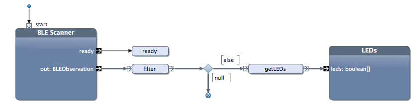

# Lab A4: Bluetooth on the Raspberry Pi

## Add the Bluetooth Dongle

Plug the bluetooth dongle into one of the USB ports of the Pi. 

## Install BlueZ

We also need to install some extra programs to make Bluetooth work on the Raspberry Pi. Just type the following:

    sudo apt-get install bluetooth bluez-utils
    
This may take ca. 5 to 10 minutes.     
    
    
## Activate the Beacon    
    
Place the battery into the beacon. Make sure that the side of the battery that is marked with `+` points the right way. It should touch the big metal latch on the beacon that is also marked with a `+`.   

## Configure the Beacon  

**Til stuassene: Beskrivelsen for app'en mangler enda. Se om dere klarer det med iPhone eller Android. Ellers kan dere bruke beacons som de er. Det er kun vitkgi at vi har entydige konfirgurasjoner når det er mange som jobber i samme rom.** 

Install the application called **nRF Beacons** either from the App Store on the iPhone or from the Google Play Store for Android. (If you do not have any of the compatible phones, do this tak together with anothe team that has one.)

Put the beacon into configuration mode, by pressing the button shown below:

You can configure the beacon so that it sends a specific major and minor number. In this way, we can distinguish different beacons, and find the ones we are actually interested in. 

Configure it the following way:

    Major: 41 (Same for all beacons in this course!)
    Minor:  x (with x = your team number, 1 to 24)

We do not need a specific UUID.

## Starting and Stopping Java Programs

All programs need again be started with the `sudo` prefix.

The program cannot be stopped with `Ctrl-c`. Use `Ctrl-z` instead.

## Application 1:

Download the project **ttm4175.bluetooth** from the Team *TTM4175 (2014)*. It contains the BLE Scanner block, which receives the BLE advertising data.

It also contains the application **Scan Beacon 1**.

Start the BLE scanner. You will see a lot of BLE data, from your own beacon and that from others. It may look a bit like this:

    BLEObservation [nodeName=b23bf5dc-dd1e-4296-a5a5-831b94188ee6, bleDeviceID=E2:C3:1F:1E:FD:A9, bleAdvertisingData=0201041aff590002150112233445566778899aabbccddeeff00001009bbb, rssi=-13, averageRssi=-13, major=41, minor=25, uuid=0112233445566778899aabbccddeeff0]
    BLEObservation [nodeName=b23bf5dc-dd1e-4296-a5a5-831b94188ee6, bleDeviceID=E2:C3:1F:1E:FD:A9, bleAdvertisingData=0201041aff590002150112233445566778899aabbccddeeff00001009bbb, rssi=-15, averageRssi=-15, major=41, minor=25, uuid=0112233445566778899aabbccddeeff0]
    BLEObservation [nodeName=b23bf5dc-dd1e-4296-a5a5-831b94188ee6, bleDeviceID=E2:C3:1F:1E:FD:A9, bleAdvertisingData=0201041aff590002150112233445566778899aabbccddeeff00001009bbb, rssi=-15, averageRssi=-15, major=41, minor=25, uuid=0112233445566778899aabbccddeeff0]

If you see this, the Bluetooth scanner is working.

## Application 2:

Filter out all BLE data that does not have the minor number that corresponds to your team. So only print out data that matches your beacon.

## Application 3:

The rssi is a meassure for the signal strength. Meassure now the signal strength for different distances. You will see that the rssi will change even if you leave the beacon at a constant distance. Therefore, meassure 10 values for each distance and note them down in a table.

Calculate the average of the values, and plot them into a diagram.

## Application 4:

 

Build an application that show with the LEDs of the Berryclip how far your beacon is away from the Pi.

    very close: green
    within 1 m: yellow
    within 2 m: red

Try to find sensible values for the RSSI from the diagram above.

**Hints:**
Use the block LEDs from the Berryclip Library, version 1.7.0. The newest version of this library is probably already installed after you have downloaded the other project from above.

You can get the RSSI from the method `getRssi()`from the BLEObservation class.

	public BLEObservation filter(BLEObservation o) {
		if(o.getMinor()== 155 ) { // team id
			return o;
		} else {
			return null;
		}
	}

	public boolean[] getLEDs(BLEObservation o) {
		boolean[] leds = new boolean[6];
		int rssi = o.getRssi();
		System.out.println(rssi);
		if(rssi>-22) {
			// very close
			leds[5] = leds[4] = true;
		} else if (rssi>-45) {
			// up to 1 m
			leds[3] = leds[2] = true;
		} else if (rssi>-71) {
			// up to 2 m
			leds[0] = leds[1] = true;
		} 
		return leds;
	}
    
    
    
    
**Task:**    
Move the beacon to and from the Pi. Is it working? Is it also stable?    

## Application 5:

Change your application, and use the method `getAverageRssi()` from the BLEObservation class instead. Now make the experiment from above again. How do the LEDs change now? Do you see an improvement?
What is the downside of this approach?

