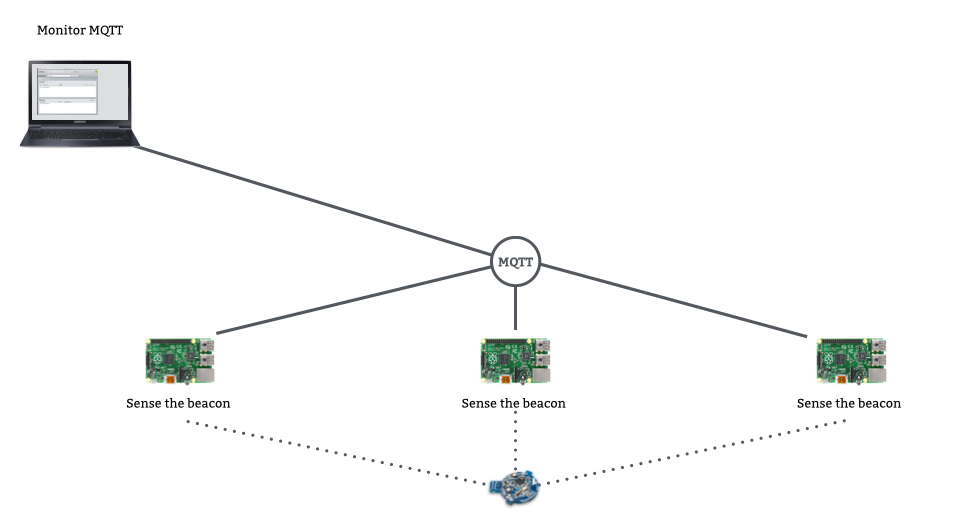
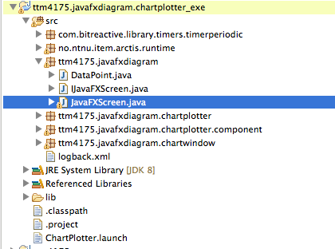
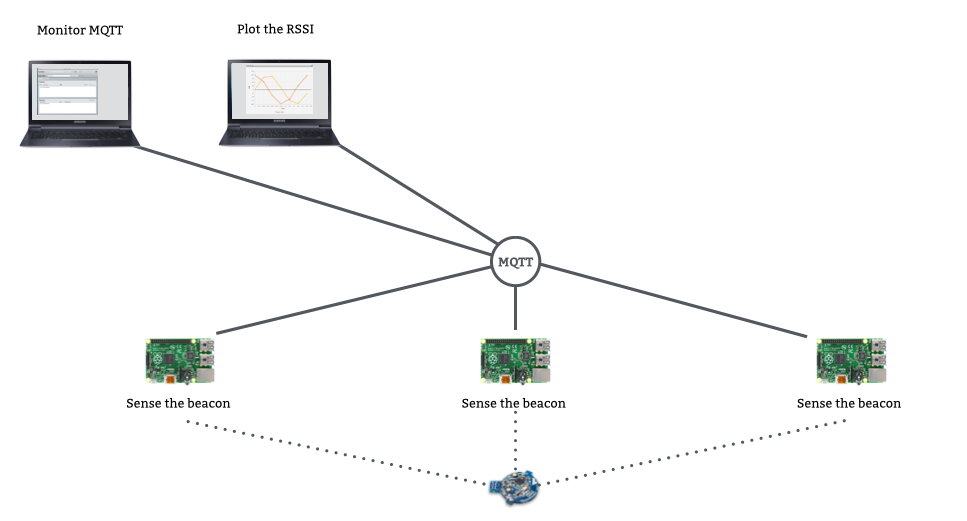
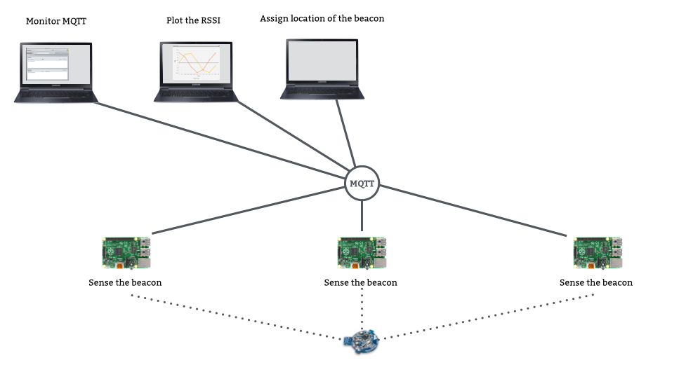
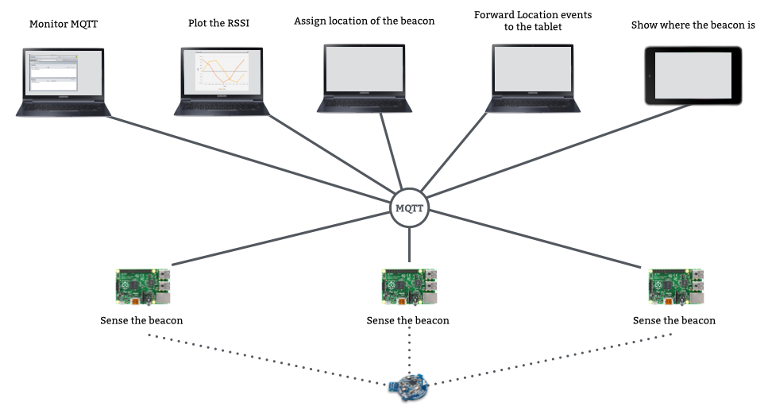

# Lab A5: Location Detection (Putting it All Together)

In this lab, we build a more complete system so that we can detect the approximate location of a beacon. We'll use three Raspberry Pis, together with some applications running on PCs for processing data and debugging.

## Local MQTT Broker

We are going to use a local MQTT broker. Find the address on the whiteboard.

## Teamwork

3 teams should work together. You should find 2 other teams. Note that the application works best if the Raspberry Pis are as far away from each other as possible. Therefore, chose teams that sit as far away as possible. If you sit too close, you can towards the end also move your Pis to another side of the room, to get them more separated.

It is also a good idea that you meet and plan who is going to do what. If you work smart with each other, you can save quite some time.

* Agree on the topics to use to send data between all units
* Agree on the minor ID for the beacon you want to listen to (choose one of the three team names, so avid clashes with other teams)
* Agree which team has the Pi for the green, yellow, red zone 

For the report:

* Write in the report with which other two teams you have worked together.
* Each teams still writes their own report.
* Of course, you can share screenshots and other data with the other two teams.

Each team can prepare a different thing, since they are only needed once:

* Install one laptop with Java 8
* Install the Android application
* Start charging the tablet immediately, so you can use it afterwards
* Install the [MQTT.fx][MQTT.fx] application, if not already done
* Install the BLE Receiver system

[MQTT.fx]: ../a3/mqtt.html

## Create the Zone Scanner for the Raspbery Pi

Each team should do this:

* Find the block **Zone Scanner** in project *ttm4175.bluetooth.zone* from last week
* Modify it:
  * Only forward BLE data from the beacon with your minor id. Otherwise you will receive too many disturbing events from the other teams.
  * Each of the Pis represents a zone. Therefore, set the node name (the same as the zone name, red, yellow, green) correctly in the zone scanner.

After that, you should have 3 Raspberry Pis running and reporting Bluetooth data into the system.

## 3 Teams Together: Check the Zone Scanner

* Each team starts their Raspberry Pi with the Zone Scanner
* Start the MQTT.FX application and subscribe to the topics
* Make sure that each of the 3 Raspberry Pis sends in BLE data

* Copy the payload of some data out of the MQTT message (from MQTT.fx)
* Validate and print the JSON data nicely, using [this website][json].
* Paste the result in your report.
* Show also a screnshot of MQTT.fx in your report.

[json]: http://jsonlint.com/

## 3 Teams Together: Print RSSI Data

The graph application is implemented in JavaFx. This is a framework to build graphical user interfaces. It is included in Java 8. 

* Configure and modify the Chart Plotter application
* (Note that you cannot simply duplicate Chart Plotter, then the startup would not work without adjustment.)

**Starting the Chart Plotter application:** Since the application is running as a JavaFX application, you have to start it a bit differently than all the other systems.

* Build it as usual, for Java SE.
* Find the generates *_exe* project.
* Find the class *ttm4175.javafxdiagram.JavaFXScreen.java*
* Right-click, and select *Run As / Java Application*

;

* You can adjust the window size of the chart plotter to show more elements.
* Receive the data you are interested in, and add data points to the digram. 
* Find out how many data points can be shown in the diagram before it gets too much. Stop data points automatically at some time.
* (The generated *Start.java* class will **not** work. The generated launch configuration *ChartPlotter.launch* does not work either. This is because JavaFX applications are started slightly different than the other Java programs.) 

**Task:** Record the RSSI and the average RSSI of one beacon moving towards **one** Pi. Include a screenshot in your report, and explain the difference between the two graphs. 

**Task:** Record the average RSSI of one beacon and **two** Pis that are far away from each other while walking from one Pi to the other. Incude a screenshot of the graph in your report and explain it.

## Configure the BLE Location Center Application

The BLE Location Center application receives the RSSI of the beacons from all connected Pis and decides based on the RSSI ion which zone the beacon most likely is.

* Import the project *ttm4175.bluetooth.central*
* The system is called *BLE Location Center*

* Adjust the BLE Receiver application so it matches your selected topics
* It needs to subscribe to the right topic to receive the BLE Observation data from the Pis
* It needs to publish the Location events to the right topic

## Setting Up the Table App

The tablet app should in the end show, in which zone (red, yellow, green) the beacon is. The tablet app is listening to an MQTT topic that you can configure at startup. The app then expects that the string "red", "yellow" or "green" are sent to that topic, and will then display the zone.
In the end, you should walk from zone to zone with beacon and tablet, and you should see how it updates your zone.

* Go to *Settings*, *Wi-Fi* and connect to Eduroam.
  * Use PEAP and MSCAPV2
  * Your identity is your username at NTNU, plus the suffix `@ntnu.no`
  * Password is your usual NTNU password
  * Remember to clear the password at the end of the lab
* Go to *Settings*, *Security* and check **Unknown sources** to allow applications that are not from the Google Play market.
* Open the browser and download: http://people.item.ntnu.no/~jhklemet/courses/ttm4175/location_app.apk
* Open the download and install the app
* Start the app and edit the settings
    - App status should be "MQTT ok" when everything is working
    - If you don't receive location updates, make sure that you have set the correct subsciber topic
    
 Use again the MQTT.fx application and publish the messages with payload "red", "yellow", "green" to the topic you are using for the tablet, and see if the tablet updates the location.
 

## Briding Location Events to the Tablet App

The tablet app does not understand the location data that the BLE Receive Application is sending. Therefore, you should create a very simple application running on a PC. It should receive location updates (via MQTT) and send out data to the tablet app, (again via MQTT). 

It is enough if this application runs on one PC of one team. Share the screenshot of the application for the report.

## Find a Conclusion

Given the experiments above, how would you evaluate this system for usage for instance in a hospital, to find in which room a nurse is?

* To which degree did the system work?
* How could the system be improved?
* What were the conditions under which you have tested the system?

## Optional: Improve the Application on the Raspberry

So far, the application on the Raspberry only sends in data to the BLE receiver. Only the tablet listens (indirectly) to the location data. 

Extend the Zone Scanner application so that it listens to Location Events. For instane, when a beacon enters a zone, change the LEDs and play a sound with the buzzer.

    
## At the End

* Remove your Eduroam credentials from the Android tablet.